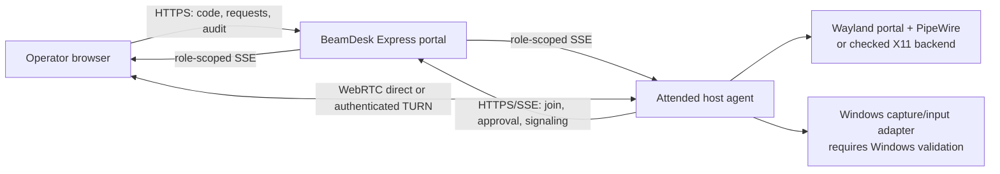

# BeamDesk

**Attended, consent-gated remote support for Windows and Linux desktops.**

BeamDesk is a development-stage remote-support product built around a public one-time code, distinct view and control approvals, short-lived signaling credentials, and an emergency end path. It is designed to fail closed when the local desktop cannot provide a supported user-visible capture or input approval mechanism. [1] [2]

| Project status | Current evidence |
|---|---|
| Portal | Node.js/Express implementation with session lifecycle, audit, rate controls, WebRTC signaling relay, input validation, and health checks. |
| Linux host | Rust implementation with Wayland portal/PipeWire and guarded X11 foundations; real interactive-desktop acceptance tests remain required. |
| Windows host | WPF approval shell is present. Windows Graphics Capture and attended `SendInput` validation require the connected Windows 10/11 development environment. |
| License | [MIT](LICENSE). |

## Table of contents

- [Safety model](#safety-model)
- [Architecture](#architecture)
- [Supported environments](#supported-environments)
- [Getting started](#getting-started)
- [Configuration](#configuration)
- [Portal API](#portal-api)
- [Testing](#testing)
- [Deployment](#deployment)
- [Project structure](#project-structure)
- [Roadmap and validation](#roadmap-and-validation)
- [Contributing and security](#contributing-and-security)
- [License and acknowledgments](#license-and-acknowledgments)

## Safety model

BeamDesk is **attended support only**. A supporter creates a short-lived code, the host joins with that code, and the host must approve viewing and then control as separate actions. Session expiry, end, and abuse reporting terminate the session and invalidate live-event credentials. Terminal audit records remain available to authenticated participants for up to one hour before the in-memory session record is purged. The portal accepts only canonical pointer, button, keyboard, and bounded wheel envelopes after control is active. [1]

> BeamDesk does not provide unattended access, background control, secure-desktop or UAC bypassing, lock-screen automation, or a fallback that bypasses a Wayland compositor’s portal.

## Architecture



The portal is the state and signaling boundary; it does not receive desktop video frames. After view approval, peers exchange opaque WebRTC offer, answer, and ICE candidate envelopes. The optional TURN configuration endpoint issues role-scoped credentials only for a currently consented session. [1]

## Supported environments

| Environment | Current path | Status |
|---|---|---|
| Windows 10/11 interactive desktop | WPF approval interface; planned Windows Graphics Capture and attended input adapter. | Requires Windows build and real-device validation. |
| Linux Wayland with ScreenCast and RemoteDesktop portals | XDG portals → PipeWire → GStreamer WebRTC; portal-mediated input. | Native foundation implemented; requires GNOME/KDE real-desktop validation. |
| Linux X11 with capture and XTEST support | Local display verification → `ximagesrc` → GStreamer WebRTC; checked XTEST input. | Native foundation implemented; requires Xorg real-desktop validation. |
| Headless or unsupported desktop | No capture or control backend. | Fails closed. |

See [compatibility-matrix.md](compatibility-matrix.md) and [acceptance-matrix.md](acceptance-matrix.md) for the exact runtime checks and validation cases.

## Getting started

### Portal prerequisites and installation

Install **Node.js 22** and pnpm. Then install dependencies and start the portal:

```bash
git clone https://github.com/vincenzo-afk/beamdesk-portal.git
cd beamdesk-portal
pnpm install --frozen-lockfile
pnpm dev
```

The local portal listens on port `4173` unless `PORT` is set. Open `http://127.0.0.1:4173/`, create a support code from the operator interface, and join it from the host interface. A native host must still handle local display and control approvals.

### Linux host prerequisites and test command

The Linux host requires a current Rust toolchain plus GStreamer, PipeWire/XDG portal components for Wayland, or an interactive X11 session with the required extensions. Its cargo tests can be run with:

```bash
cd linux-host-agent
cargo test
```

For an attended development run, pass role-scoped values produced by the host join flow:

```bash
export BEAMDESK_PORTAL_URL="http://127.0.0.1:4173/"
export BEAMDESK_SESSION_ID="session-id-from-join"
export BEAMDESK_SESSION_TOKEN="host-token-from-join"
# Set only for Wayland when the required portal is available.
export BEAMDESK_PORTAL_AVAILABLE=1
cargo run
```

The agent asks the person at the host computer for an affirmative local view confirmation before opening a capture source. A later control request triggers an independent local confirmation and backend-specific approval. [2]

### Windows host

The Windows WPF project is in `windows-host-agent/BeamDesk.HostAgent`. Build it on Windows with the .NET SDK described in [windows-host-agent/README.md](windows-host-agent/README.md). The current code is an attended approval shell; it must not be represented as a tested capture or input implementation until it is built and validated on Windows 10/11.

## Configuration

| Variable | Scope | Purpose |
|---|---|---|
| `PORT` | Portal | Optional listener port; defaults to `4173`. |
| `BEAMDESK_TRUST_PROXY` | Portal deployment | Set to `true` only behind the configured reverse proxy, such as the Render Blueprint. |
| `BEAMDESK_TURN_URLS` | Portal deployment | Comma-separated `turn:` or `turns:` relay URLs. |
| `BEAMDESK_TURN_SHARED_SECRET` | Portal deployment | CoTURN REST shared secret. Keep it only in the deployment secret store. |
| `BEAMDESK_TURN_HMAC_ALGORITHM` | Portal deployment | Optional credential HMAC algorithm; defaults to `sha1`. |
| `BEAMDESK_PORTAL_URL` | Linux/Windows host | Portal base URL. Linux rejects non-local HTTP URLs. |
| `BEAMDESK_SESSION_ID` | Linux host | Role-scoped session identifier returned by the attended join flow. |
| `BEAMDESK_SESSION_TOKEN` | Linux host | Role-scoped host token returned by the attended join flow. |
| `BEAMDESK_PORTAL_AVAILABLE` | Linux Wayland host | Set to `1` only when the XDG portal capability is available. |

The portal works in direct-only WebRTC mode when TURN variables are unset. The health endpoint reports this state but never returns a secret. [1]

## Portal API

All session routes use `x-session-token` after creation or join. Event streams require a short-lived, single-use event token obtained through the corresponding endpoint. [1]

| Method | Path | Purpose |
|---|---|---|
| `GET` | `/healthz` | Cache-safe deployment readiness response. |
| `POST` | `/api/sessions` | Create a ten-minute support code and operator token. |
| `POST` | `/api/sessions/join` | Join one unused code and receive a host token. |
| `GET` | `/api/sessions/:id` | Read the role-scoped session state and permitted actions. |
| `GET` | `/api/sessions/:id/audit` | Retrieve authenticated audit history, including terminal sessions during the one-hour retention window. |
| `POST` | `/api/sessions/:id/view-request` | Operator requests view approval. |
| `POST` | `/api/sessions/:id/control-request` | Operator requests separate control approval. |
| `POST` | `/api/sessions/:id/host-action` | Host approves, denies, or revokes a permitted action. |
| `POST` | `/api/sessions/:id/signal` | Relay an opaque WebRTC offer, answer, or candidate after view approval. |
| `POST` | `/api/sessions/:id/input` | Submit canonical remote input only after control approval. |
| `GET` | `/api/sessions/:id/ice-config` | Retrieve active-session TURN credentials when configured. |
| `POST` | `/api/sessions/:id/end` | End a session. |
| `POST` | `/api/sessions/:id/report-abuse` | Record an abuse category and end the session. |

## Testing

Run the verified automated suite and smoke check with:

```bash
pnpm test
cd linux-host-agent && cargo test
cd ..
BEAMDESK_SMOKE_URL="http://127.0.0.1:4173/" pnpm smoke
```

The test suites cover portal authorization, approval state transitions, session expiry, audit access, input validation, abuse limits, TURN failure handling, Linux capability selection, input mapping, and native media-graph construction. They do not prove interactive desktop integration. Use the [acceptance matrix](acceptance-matrix.md) for required Windows, Wayland, X11, and relay real-device tests.

## Deployment

`render.yaml` defines a Render Blueprint for the portal. Connect the repository in Render, configure protected TURN values only after a separate CoTURN service has been deployed, and verify the result with `pnpm smoke`. The portal Blueprint intentionally does not deploy CoTURN because a relay requires a persistent host and appropriate UDP/TCP network support. See [render-deployment-notes.md](render-deployment-notes.md) and [turn-reliability-notes.md](turn-reliability-notes.md).

## Project structure

```text
.
├── public/                  # Browser operator and host portal UI
├── server.mjs               # Express session, audit, signaling, and input relay
├── test/                    # Node built-in portal regression tests
├── scripts/smoke.mjs        # Health-check smoke utility
├── linux-host-agent/        # Rust Wayland/X11 host implementation
├── windows-host-agent/      # WPF attended-host approval shell
├── render.yaml              # Render portal Blueprint
├── compatibility-matrix.md  # Supported desktop policy
└── acceptance-matrix.md     # Automated and real-device acceptance evidence
```

## Roadmap and validation

The next release-critical work is deployment-connected: provision and test a persistent CoTURN relay, validate the Linux host on GNOME/KDE Wayland and X11, and implement and test Windows Graphics Capture plus attended input on a connected Windows 10/11 desktop. The exact verification scenarios are recorded in [acceptance-matrix.md](acceptance-matrix.md).

## Contributing and security

Read [CONTRIBUTING.md](CONTRIBUTING.md) before submitting a change. The project does not yet publish a private vulnerability-reporting contact; until one is configured, avoid placing sensitive details in public issues. The code and documentation retain the attended-only boundary as a non-negotiable contribution requirement.

## License and acknowledgments

BeamDesk is released under the [MIT License](LICENSE). Its implementation uses Express, GStreamer, Rust bindings for XDG Desktop Portal, and X11 protocol bindings; platform capture and control policy follows the respective native desktop mechanisms. [2] [3] [4]

## References

[1]: https://github.com/vincenzo-afk/beamdesk-portal/blob/master/server.mjs "BeamDesk portal implementation"
[2]: https://github.com/vincenzo-afk/beamdesk-portal/blob/master/compatibility-matrix.md "BeamDesk compatibility policy"
[3]: https://flatpak.github.io/xdg-desktop-portal/docs/doc-org.freedesktop.portal.RemoteDesktop.html "XDG Desktop Portal: RemoteDesktop"
[4]: https://gstreamer.freedesktop.org/documentation/ximagesrc/index.html "GStreamer: ximagesrc"
